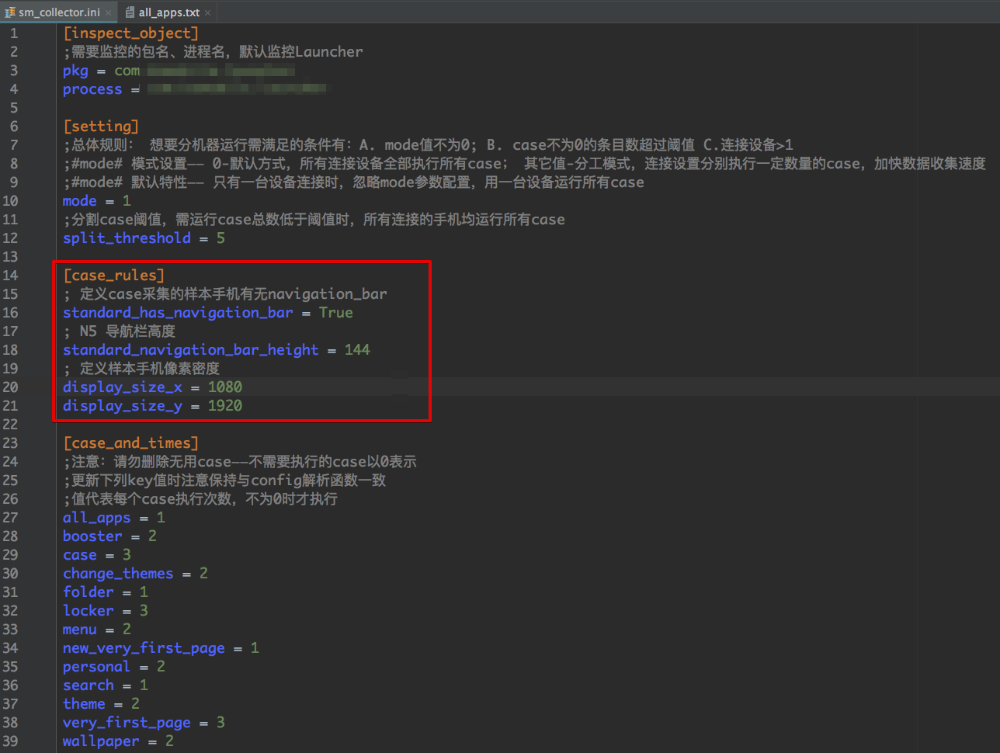

# PhonePerformanceMeasure
> 基于 python 2.7

纲：

* 手动收集App运行流畅度
* SM流畅度自动收集程序
* 自动安装apk，自动进行MonkeyTest
* MonkeyKiller 结束所有连接的手机上的Monkey测试
* GrabDump抓取dump文件，自动拉至pc，自动convert成MAT可识别的文件格式

工具APK：

> 位于/util目录下

* 流畅度SM值自动收集、保存：sm_collector.apk
* 保持wifi常开apk：wifi_keeper.apk
* 覆盖系统状态栏apk：status_bar_helper.apk


## 手动收集App运行流畅度

**使用的App：./util/sm_collector.apk (工程util目录下) [git repo](https://github.com/KyleCe/GT/tree/master/importForAS)**

适用范围：一般的应用程序（需要知道包名、进程名）

> 需要手机授予Root权限 （核心逻辑通过命令行实现）

使用方法：

1. 安装、打开APP、回到桌面

2. 通过adb发送收集命令：

   ~~~
   1. 开始收集：
   >$ adb shell am broadcast -a com.kylece.gt.turn_on_sm —es "package_name" "your_pkg" —es "process_name" "your_pro" —es "file_tag_name" "your_file_name" --es "folder_tag_name" "your_folder_name"

       参数说明：
       --es "package_name" "your_pkg" //包名
       --es "process_name" "your_pro" //进程名
       --es "file_tag_name" "your_file_name" //文件名
       --es "folder_tag_name" "your_folder_name" //文件夹名
       （第3、4个参数可以不填，缺省的文件夹名为SM，文件名为pkg名+时间戳）
       
   2. 停止监控，输出报表：
   >$ adb shell am broadcast -a com.kylece.gt.turn_off_sm
   // 报表保存目录：/sdcard/GT/GW/your_package_name/versio_code/your_folder_name
   ~~~

3. 支持app在adb命令之后启动的模式（可用于测试app启动的流畅度测试）


## SM流畅度自动收集程序

> 运行方法：导航至工程目录 execute：
>
> ~~~python
> python SMCollector.py
> ~~~
>
> PS: 需要手机授予Root权限 （核心逻辑通过命令行实现）

**在 ./config/sm_collector.ini中配置各项特性**
支持的配置选项有：
1. 要监控的APP
2. 运行模式（分工进行/全全工进行）
3. case采集标准手机的具体信息（无需繁琐地采集各分辨率case）
4. 自定义添加case及各case运行次数
5. case支持的动作：点击、滑动、长按、home、back、wait
6. 对测试启动app这一特殊case的支持

其它说明：
* **case只需用标准手机采集一次，即可自动适配所有分辨率手机（对标准采集手机不做限制[任意分辨率、也不限制是否有导航栏]，在ini中配备）**

* 源case文件在目录./case下（需以.txt结尾）

* 可以多设备分配任务进行（用ini文件中的setting选项控制，详细操作办法见ini中注释）

* 收集的输出文件默认拉取至./output目录下

  具体配置说明如下图：

  

## MonkeyTest
运行Monkey测试
### 注意：
* 预想测试的包需要放到./apk目录下
* apk文件应该包含一个独有的关键字
    * 还需要保持其与./config/monkey.ini中的[target_key_word]pkg_key字段相一致（默认是bitmap）

### feature
* 多设备支持
* **保持WiFi常开 apk位于/util目录下（[git repo](https://github.com/KyleCe/WifiKeeper)）**
* 出现异常时，结束Monkey
* 安装过包之后不再卸载
* **遮挡通知栏，防止Monkey点击通知栏，引发一系列问题 apk位于 /util目录下 ([git repo](https://github.com/KyleCe/simiasque))**

### TODO
已知在部分机型上，monkey抓取RuntimeException会出现异常（LGN5x 7.0）

### 启动：
~~~ python
python MonkeyTest.py
~~~

### 关于输出的说明
log目录下：
1. Nexus5_6_0_1_bluetooth_CCFA0037328C_logcat_2017-09-22-17-47-06.logcat
2. Nexus5_6_0_1_bluetooth_CCFA0037328C_logcat_2017-09-22-17-47-07
3. Nexus5_6_0_1_bluetooth_CCFA0037328C.log

> 范式：

> Model_androidVersion_bluetoothAddress(_type_time)

> Model之后之后跟的是AndroidVersion与Bluetooth地址

第一个是出现异常时的logcat文件，也是以时间做区分

第二个是存本地日志的dir，以时间作区分

第三个是Monkey日志，每次使用前清空

--------
## MonkeyKiller.py
结束所有连接设备的Monkey测试：


### 启动：
~~~ python
python MonkeyKiller.py
~~~


## GrabDump

```python
python GrabDump.py
```


> 抓取dump文件，自建目录，并进行convert； 

> 一次输入后后续无需重复参数

> 1,2,3 参数分别为 文件名，目的目录路径，进程名

可以传递三个参数（各参数具体含义如下），缺省输入时使用最近一次输入的参数

you can pass params to define dump :(every param can be ignored)

example----$ python GradDump.py

example----$ python GradDump.py  1_file_name

example----$ python GradDump.py  1_file_name  2_destination_directory

example----$ python GradDump.py  1_file_name  2_destination_directory  3_process_name

1. 1_file_name

2. 2_destination_directory

3. 3_process_name

## DPICal.py
calculate device dpi:
```
python DPICal.py  2340 1080 6.35
# output:
dpi : 406
``` 


### NOTE:
once you've input a param already, the next time function running will use the latest param you input
